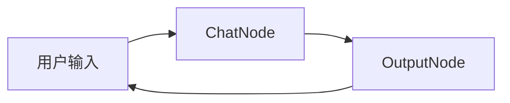
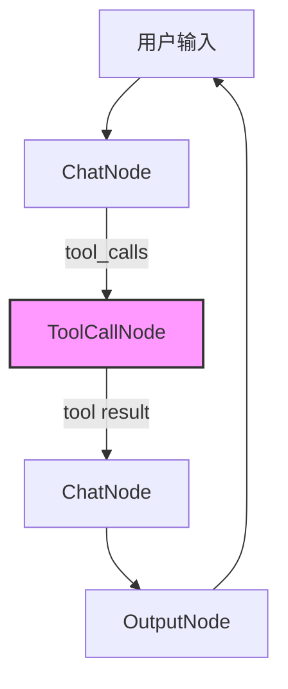
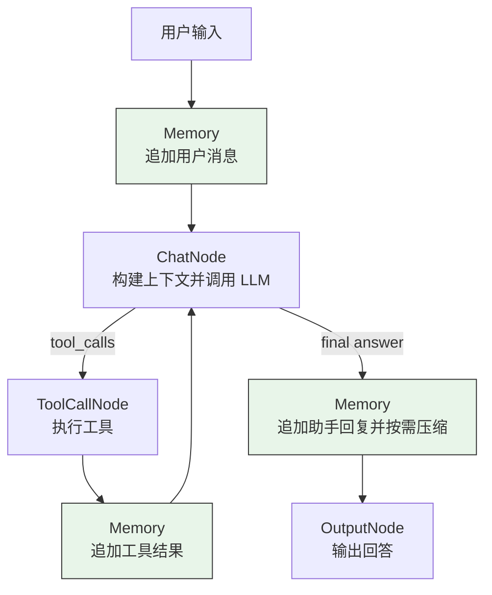
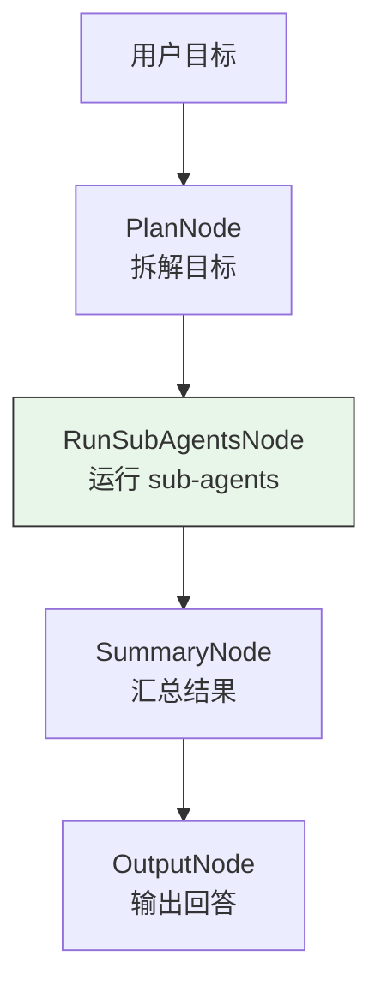
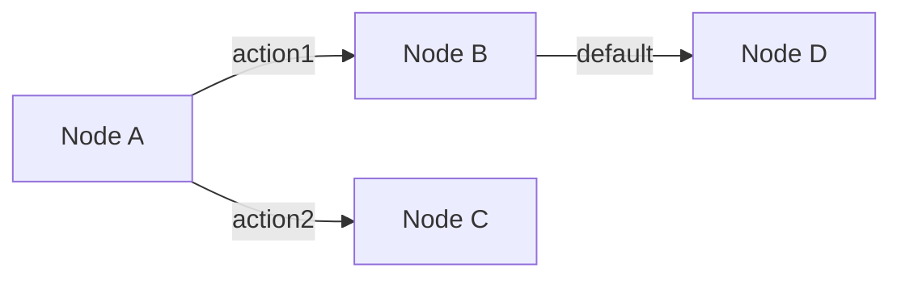
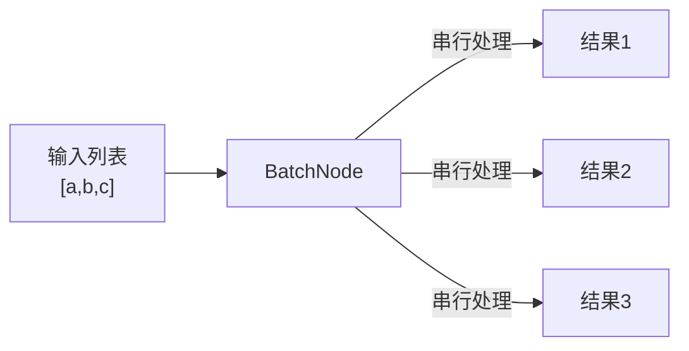
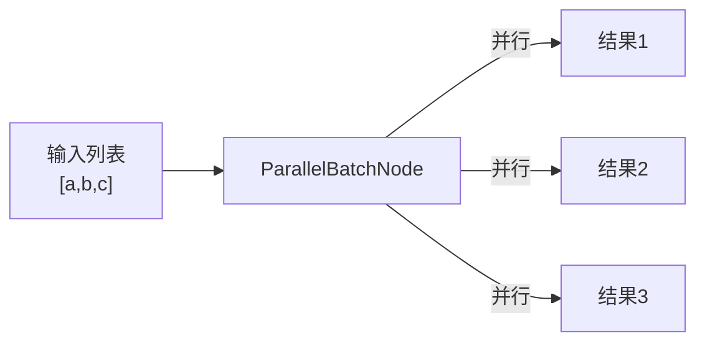

# Examples - 示例代码

本目录包含使用 PocketFlow 框架的各种示例。

## 目录结构

```
examples/
├── chatbot/              # 简单对话机器人
├── chatbot_with_tools/   # 带工具调用的对话机器人
├── chatbot_with_memory/  # 带记忆管理的对话机器人
├── chatbot_with_goal_state/ # 带 Goal 状态的对话机器人
├── chatbot_with_sub_agent/  # 父 agent + sub-agent 示例
└── workflow/             # 工作流示例
```

## 示例说明

### 1. Chatbot - 简单对话机器人

基础对话机器人，演示简单的 Node 和 Flow 使用。

```bash
python examples/chatbot/main.py
```

**流程图:**


---

### 2. Chatbot with Tools - 带工具调用的对话机器人

演示如何让 LLM 调用工具（如 ls, read 等）并获取结果。

```bash
python examples/chatbot_with_tools/main.py
```

**流程图:**


---

### 3. Workflow - 工作流示例

演示多节点协作的工作流模式。

```bash
python examples/workflow/main.py
```

**搜索工作流:**


**工作流程说明:**
1. **QueryNode**: 接收用户查询，决定路由
2. **SearchNode**: 执行搜索，获取结果
3. **SummarizeNode**: 基于搜索结果生成摘要

---

### 4. Chatbot with Memory - 带记忆管理的对话机器人

演示如何把用户消息、助手回复和工具结果保存到 `chat_memory/session.jsonl`，并在上下文接近上限时自动压缩旧消息。

```bash
python examples/chatbot_with_memory/main.py
```

**流程图:**



**记忆文件:**

- `chat_memory/session.jsonl`: 追加保存短期对话消息。
- `chat_memory/MEMORY.md`: 保存压缩后的长期记忆摘要。

---

### 5. Chatbot with Sub-Agent - 父 agent + sub-agent 示例

演示父 agent 如何把用户目标拆成几个 sub-goals，顺序交给简易 sub-agent 执行，再汇总成最终回答。

```bash
python examples/chatbot_with_sub_agent/main.py
```

**流程图:**



---

## Node 核心概念

### 基本 Node

```python
from core.node import Node

class MyNode(Node):
    def exec(self, payload):
        # 处理逻辑
        result = process(payload)
        # 返回 (action, result)
        return "default", result
```

### 节点连接



```python
# 代码实现
node_a - "action1" >> node_b
node_a - "action2" >> node_c
node_b >> node_d
```

### Batch Node



### Parallel Batch Node



---

## 运行环境

所有示例需要设置 OpenAI API Key:

```bash
export OPENAI_API_KEY=your_key_here
```

或者使用其他支持的模型（如 Anthropic）。
