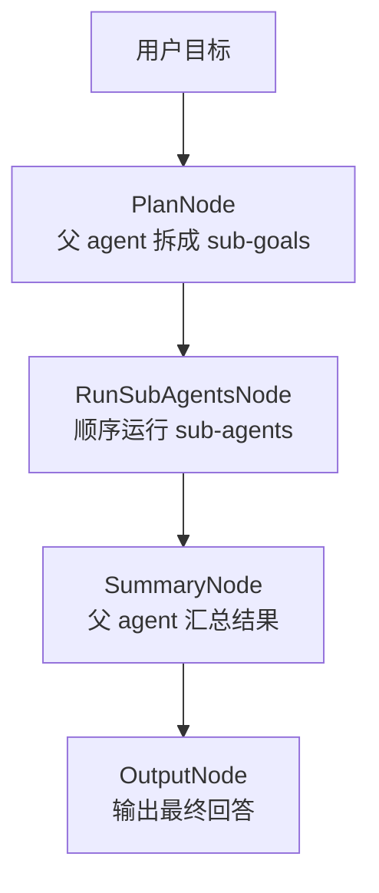

# Chatbot with Sub-Agent

这是一个极简 sub-agent 示例，用来演示父 agent 如何拆解目标、分发子目标、管理 sub-agent 生命周期，并汇总结果。

第一版刻意保持简单：

- 不接工具调用。
- 不接 Memory。
- 不接 GoalState。
- 不做并发。

这样可以先把 multi-agent / sub-agent 的核心概念讲清楚。

## 运行

```bash
python examples/chatbot_with_sub_agent/main.py
```

Windows PowerShell 可以这样设置环境变量：

```powershell
$env:OPENAI_API_KEY="your-api-key"
$env:OPENAI_BASE_URL="your-base-url"
python examples/chatbot_with_sub_agent/main.py
```

## 流程



## 代码结构

```text
chatbot_with_sub_agent/
├── README.md
└── main.py
    ├── PlanNode
    ├── RunSubAgentsNode
    ├── SummaryNode
    └── OutputNode
```

核心实现放在 `core/sub_agent.py`：

- `SubAgentTask`：保存一个子任务的 `id / goal / status / result / error`。
- `SubAgent`：只负责完成一个子目标。
- `SubAgentManager`：由父 agent 使用，负责创建任务和顺序运行任务。

## 生命周期

每个 sub-agent task 都会经历下面的状态：

```text
pending -> running -> done
pending -> running -> failed
```

如果某个 sub-agent 失败，它的错误会写到 `error` 字段，其他 sub-agent 会继续执行。

## 示例输入

```text
帮我讲清楚 Agent 的 Memory、Tool、Goal 三个模块
```

程序会先拆成几个子目标，让 sub-agent 分别回答，然后由父 agent 汇总成最终回答。
