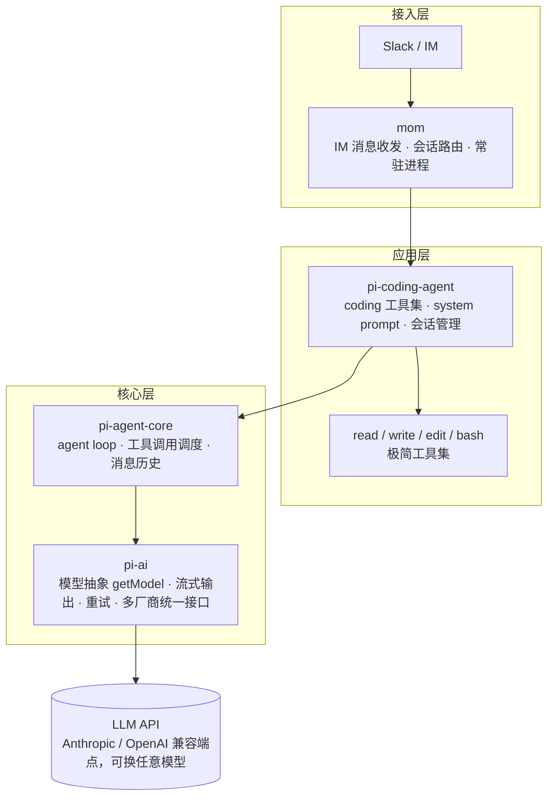
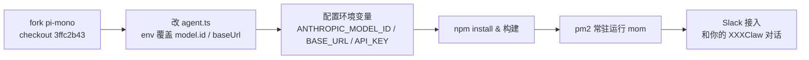

# 10 · pi-mono 架构剖析

> 本文件的定位：**让你不用真的 clone pi-mono，也能把它的架构讲清楚**。
> 内容基于 pi-mono 仓库（`badlogic/pi-mono`，教程锚定提交 `3ffc2b43`）的模块结构与作者博客
> 《What I learned building an opinionated and minimal coding agent》整理。
> 建议：跑通本教程第 8 章的改造之后，用本文件对照一遍你 fork 里的真实代码——讲的时候底气完全不同。

---

## 一句话总览

pi-mono 是一个 monorepo，共 7 个 package，但**面试只需要讲 4 个**：`pi-ai`（模型抽象层）、`pi-agent-core`（agent 循环）、`pi-coding-agent`（coding 工具集与会话）、`mom`（IM 接入与常驻运行壳）。其余 3 个（`pi-tui`、`pi-web-ui`、`pi-pods`）知道名字和职责即可。

## 架构图



## 四个模块逐个讲

### pi-ai —— 模型抽象层

- 职责：统一各家 LLM API 的差异（Anthropic、OpenAI 及兼容端点），对上暴露 `getModel(provider, id)` 这样的统一入口，处理流式输出、错误重试。
- 为什么独立成包：模型层是**最易变的依赖**——三个月换一次模型是常态。把它隔离成独立 package，换模型不动 agent 逻辑。
- 面试可讲的点：我们的改造就发生在这层的边界上——pi-mono 默认把模型写死成 `claude-sonnet-4-5`，我们通过环境变量覆盖 `model.id` 和 `model.baseUrl`，让同一个 codebase 可以跑在任何 OpenAI/Anthropic 兼容端点上（Kimi、DeepSeek、智谱……）。**模型抽象层的价值不在抽象本身，在于「换模型是一行环境变量的事」。**

### pi-agent-core —— agent 循环

- 职责：agent loop 本体——调模型、解析 tool_calls、调度工具执行、维护消息历史，直到模型给出最终答复。
- 面试可讲的点：这层是整个项目里**代码最少但语义最重**的部分。它的实现印证了一个判断：agent loop 本身没有复杂度，复杂度全在「喂给 loop 的上下文质量」上——所以工程投入应该流向工具设计、上下文管理，而不是 loop 本身（见 01 Q1 的「拉回分布内」论述，可以和这里串着讲）。

### pi-coding-agent —— coding 专用层

- 职责：在 agent-core 之上提供 coding 场景的全部特化：极简工具集（read/write/edit/bash）、system prompt、会话/工作区管理。
- 面试可讲的点：为什么 coding agent 变成了通用 agent——因为「读写文件 + 跑命令」这个能力组合可以表达几乎所有数字世界的工作。这一层的设计哲学就是作者博客的核心结论：**四个工具就是构建有效 coding agent 所需的全部**，剩下的复杂度都是负债。

### mom —— IM 接入与常驻壳

- 职责：把 coding-agent 包装成一个长期运行的 Slack bot：收发 IM 消息、把消息路由到对应会话、保持进程常驻。
- 注意：mom 在 pi-mono 后续的 `0ed0d434` 提交中被移除，所以教程锚定 `3ffc2b43`。
- 面试可讲的点：这一层回答的是「agent 怎么从 demo 变成服务」——`pm2` 负责崩溃自重启和后台常驻，IM（Slack/飞书）负责触达用户。**agent 产品化的最后一公里往往不是 AI 问题，是传统的服务化问题：常驻、重启、消息路由、会话隔离。**

## 改造链路（把 pi-mono 变成 XXXClaw）



关键改动（教程第 8 章）：

```ts
// packages/mom/src/agent.ts，getModel 之下追加：
model.id = process.env.ANTHROPIC_MODEL_ID || "claude-sonnet-4-5";
if (process.env.ANTHROPIC_BASE_URL) model.baseUrl = process.env.ANTHROPIC_BASE_URL;
```

```bash
pm2 start packages/mom/dist/main.js --name mom --interpreter node -- --sandbox=host ./packages/mom/data
```

## 面试官可能怎么问这个架构

- *「你和直接用 claude-code 有什么区别？」* → claude-code 是闭源产品，这是我自己掌控每一层的系统：模型可换（不被单一厂商绑定）、工具可裁剪、行为可 eval。讲的时候落到「可调试性 + 可替换性」两个词。
- *「为什么选 pi-mono 做底座而不是从零写？」* → 学习路径问题：从零写 loop 我在 Python 里已经写过了（本仓库 core/），但生产级 agent 的复杂度在工程细节——流式、重试、会话、常驻，这些直接站在一个被验证过的极简实现上学，比从零踩坑快一个量级。**先学会造轮子（60 行），再学会选轮子（pi-mono），最后学会改轮子（XXXClaw）**——这个三件套回答非常加分。
- *「最深的改动是什么？」* → 模型端点抽象（env 化）；如果做了工具增删或 memory 改进，讲那个，并带上动机（token 经济学 / KV cache，见 04）。
